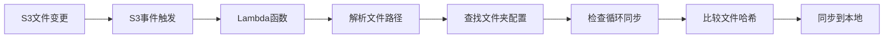

# S3到本地文件夹同步功能使用指南

## 📋 概述

S3到本地文件夹同步功能允许您将S3中的配置文件自动同步到本地的不同文件夹结构中。这个功能解决了您提出的问题：**S3监控某个文件，里面的文件可以同步到本地不同文件夹下**。

## 🏗️ 架构设计

### 同步流程
```
S3文件变更 → Lambda事件触发 → 解析文件路径 → 映射到本地文件夹 → 同步到本地
```

### 文件夹映射关系
```
S3路径结构:                   本地文件夹结构:
config/staging/test.json  →   configuration/config/test.json
config2/staging/test2.json →  configuration/config2/test2.json
config3/staging/test4.json →  configuration/config3/test4.json
```

## 🔧 核心功能

### 1. 自动同步 (`handlers/s3-to-local-folders.js`)
- **事件驱动**: 基于S3事件自动触发同步
- **智能映射**: 根据S3路径自动映射到本地文件夹
- **循环防护**: 防止无限循环同步
- **变更检测**: 只同步发生变化的文件

### 2. 手动同步 (`scripts/sync-s3-to-local-folders.js`)
- **批量同步**: 一次性同步所有文件夹的文件
- **增量同步**: 只同步发生变化的文件
- **详细日志**: 提供详细的同步日志和状态

### 3. 状态监控 (`scripts/monitor-folders-sync.js`)
- **实时监控**: 监控本地、S3、GitHub之间的同步状态
- **状态分析**: 分析文件在不同位置的一致性
- **同步建议**: 提供需要同步的文件列表

## 🚀 快速开始

### 1. 部署Lambda函数
```bash
# 部署包含S3到本地同步功能的Lambda
npm run deploy
```

### 2. 测试手动同步
```bash
# 从S3同步到本地文件夹
npm run sync-s3-to-local-folders
```

### 3. 监控同步状态
```bash
# 监控文件夹同步状态
npm run monitor-folders-sync
```

## 📋 使用命令

### 同步命令
```bash
# 从S3同步到本地文件夹
npm run sync-s3-to-local-folders

# 从本地文件夹同步到S3
npm run sync-folders-to-s3

# 监控文件夹同步状态
npm run monitor-folders-sync
```

### 环境变量
```bash
# 设置环境变量
export ENVIRONMENT=staging  # 或 production
export AWS_REGION=ap-southeast-2
export S3_BUCKET=rock-service-data
```

## 🔄 同步机制

### 1. 自动同步流程


### 2. 文件路径解析
```javascript
// S3路径: config/staging/test.json
const parts = s3Key.split('/');
const s3Prefix = parts[0];    // config
const environment = parts[1]; // staging
const fileName = parts[2];    // test.json

// 映射到本地路径: configuration/config/test.json
const localPath = `configuration/${s3Prefix}/${fileName}`;
```

### 3. 循环同步防护
```javascript
// 检查文件来源，避免循环同步
if (syncDirection === 'github-to-s3' || 
    syncedFrom === 'github-staging' || 
    syncedFrom === 'github-production') {
    // 跳过同步，避免循环
    return;
}
```

## 📊 监控和日志

### 1. 同步状态监控
```bash
npm run monitor-folders-sync
```

输出示例：
```
🔍 开始监控文件夹同步状态...

📁 检查文件夹: config (主要配置文件)
   📂 本地路径: configuration/config
   ☁️  S3前缀: config

   📄 检查文件: test.json
      ✅ 本地: 存在
      ☁️  S3 Staging: 存在
      ☁️  S3 Production: 存在
      🐙 GitHub Staging: 不存在
      🐙 GitHub Production: 不存在

📊 文件夹同步状态分析:
📁 config (主要配置文件):
   📄 test.json:
      🔄 Staging: 🔄 - S3需要同步到GitHub
      🚀 Production: 🔄 - 本地需要同步到S3
```

### 2. 同步日志
```bash
npm run sync-s3-to-local-folders
```

输出示例：
```
🚀 开始从S3同步到本地文件夹: rock-service-data
📁 环境: staging

📁 处理文件夹: config (主要配置文件)
   📄 检查文件: test.json
      ☁️  S3路径: config/staging/test.json
      📂 本地路径: configuration/config/test.json
      ☁️  S3文件存在，哈希: 676d2abf...
      📂 本地文件存在，哈希: 676d2abf...
      ⏭️  文件未变更，跳过同步

📊 从S3到本地文件夹的同步结果汇总:
✅ 成功: 0 个文件
❌ 失败: 0 个文件
⏭️  跳过: 4 个文件
```

## 🛡️ 安全特性

### 1. 循环同步防护
- 检查文件来源元数据
- 时间戳检查防止重复同步
- 同步方向标识

### 2. 文件完整性验证
- SHA256哈希值比较
- JSON格式验证
- 文件大小检查

### 3. 错误处理
- 详细的错误日志
- 优雅的错误处理
- 重试机制

## 📈 使用场景

### 1. 多环境配置管理
```bash
# 开发环境
export ENVIRONMENT=staging
npm run sync-s3-to-local-folders

# 生产环境
export ENVIRONMENT=production
npm run sync-s3-to-local-folders
```

### 2. 配置文件分类管理
```
configuration/
├── config/          # 主要配置
│   └── test.json
├── config2/         # 次要配置
│   ├── test2.json
│   └── test3.json
└── config3/         # 第三方配置
    └── test4.json
```

### 3. 团队协作
- 团队成员可以独立管理不同文件夹的配置
- 自动同步确保配置一致性
- 版本控制跟踪配置变更

## 🔧 配置说明

### 1. 文件夹配置 (`config/folders.json`)
```json
{
  "folders": [
    {
      "name": "config",
      "description": "主要配置文件",
      "local_path": "configuration/config",
      "s3_prefix": "config",
      "files": [
        {
          "name": "test.json",
          "description": "主要配置文件"
        }
      ]
    }
  ]
}
```

### 2. 监控配置
```json
{
  "monitoring": {
    "s3_paths": [
      {
        "prefix": "config/staging/",
        "suffix": ".json",
        "environment": "staging"
      },
      {
        "prefix": "config/production/",
        "suffix": ".json",
        "environment": "production"
      }
    ]
  }
}
```

## 📊 性能优化

### 1. 智能同步
- 只同步发生变化的文件
- 哈希值比较避免不必要的操作
- 增量同步减少网络传输

### 2. 并发处理
- Lambda函数支持并发处理
- 异步文件操作
- 批量处理提高效率

### 3. 缓存机制
- 本地文件缓存
- 元数据缓存
- 哈希值缓存

## 🔍 故障排除

### 常见问题

#### 1. 同步失败
```bash
# 检查配置
npm run manage-folders validate

# 检查文件权限
ls -la configuration/

# 查看详细日志
npm run sync-s3-to-local-folders
```

#### 2. 循环同步
```bash
# 检查文件元数据
npm run monitor-folders-sync

# 清理元数据
# 手动删除S3文件重新上传
```

#### 3. 文件不一致
```bash
# 强制同步
# 删除本地文件后重新同步
rm -rf configuration/
npm run sync-s3-to-local-folders
```

## 📚 相关文件

- `handlers/s3-to-local-folders.js` - S3到本地同步处理器
- `scripts/sync-s3-to-local-folders.js` - 手动同步脚本
- `scripts/monitor-folders-sync.js` - 同步状态监控
- `utils/folder-manager.js` - 文件夹管理器
- `config/folders.json` - 文件夹配置

## 🎯 总结

S3到本地文件夹同步功能完美解决了您的需求：

### ✅ 已实现的功能
- **自动同步**: S3文件变更自动同步到本地对应文件夹
- **智能映射**: 根据S3路径自动映射到本地文件夹结构
- **循环防护**: 防止无限循环同步
- **变更检测**: 只同步发生变化的文件
- **状态监控**: 实时监控同步状态
- **手动同步**: 支持手动批量同步

### 🔄 同步流程
1. **S3文件变更** → 触发Lambda事件
2. **解析文件路径** → 提取文件夹和文件名
3. **查找配置映射** → 根据S3前缀找到本地文件夹
4. **检查循环同步** → 避免无限循环
5. **比较文件哈希** → 只同步变更的文件
6. **同步到本地** → 写入本地对应文件夹

### 📈 优势
- **自动化**: 无需手动操作，自动同步
- **准确性**: 基于哈希值比较，确保准确性
- **效率**: 只同步变更文件，提高效率
- **安全**: 完善的循环防护和错误处理
- **可扩展**: 支持动态添加文件夹和文件

这个功能让您可以轻松管理大量的配置文件，确保S3和本地文件夹之间的实时同步。 